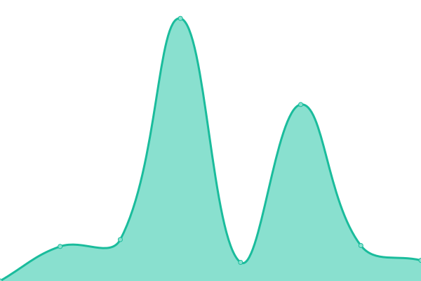

# [📈 Live Status](https://pacharanero.github.io/upptime-pacharanero): <!--live status--> **🟧 Partial outage**

This repository contains the open-source uptime monitor and status page for [Marcus Baw](bawmedical.co.uk), powered by [Upptime](https://github.com/upptime/upptime).

With [Upptime](https://upptime.js.org), you can get your own unlimited and free uptime monitor and status page, powered entirely by a GitHub repository. We use [Issues](https://github.com/pacharanero/upptime-pacharanero/issues) as incident reports, [Actions](https://github.com/pacharanero/upptime-pacharanero/actions) as uptime monitors, and [Pages](https://pacharanero.github.io/upptime-pacharanero) for the status page.

<!--start: status pages-->
<!-- This summary is generated by Upptime (https://github.com/upptime/upptime) -->
<!-- Do not edit this manually, your changes will be overwritten -->
<!-- prettier-ignore -->
| URL | Status | History | Response Time | Uptime |
| --- | ------ | ------- | ------------- | ------ |
|  [2018.cawoodstock.org](https://2018.cawoodstock.org) | 🟩 Up | [2018-cawoodstock-org.yml](https://github.com/pacharanero/upptime-pacharanero/commits/HEAD/history/2018-cawoodstock-org.yml) | 

 322ms
     
 | 

<a href="https://pacharanero.github.io/upptime-pacharanero/history/2018-cawoodstock-org">100.00%</a>
    

|  [2019.cawoodstock.org](http://2019.cawoodstock.org) | 🟩 Up | [2019-cawoodstock-org.yml](https://github.com/pacharanero/upptime-pacharanero/commits/HEAD/history/2019-cawoodstock-org.yml) | 

 554ms
     
 | 

<a href="https://pacharanero.github.io/upptime-pacharanero/history/2019-cawoodstock-org">100.00%</a>
    

|  [batsignal-live.herokuapp.com](https://batsignal-live.herokuapp.com/) | 🟩 Up | [batsignal-live-herokuapp-com.yml](https://github.com/pacharanero/upptime-pacharanero/commits/HEAD/history/batsignal-live-herokuapp-com.yml) | 

 257ms
     
 | 

<a href="https://pacharanero.github.io/upptime-pacharanero/history/batsignal-live-herokuapp-com">100.00%</a>
    

|  [bawmedical.co.uk](https://bawmedical.co.uk) | 🟩 Up | [bawmedical-co-uk.yml](https://github.com/pacharanero/upptime-pacharanero/commits/HEAD/history/bawmedical-co-uk.yml) | 

 640ms
     
 | 

<a href="https://pacharanero.github.io/upptime-pacharanero/history/bawmedical-co-uk">100.00%</a>
    

|  [cawood.life](https://cawood.life) | 🟩 Up | [cawood-life.yml](https://github.com/pacharanero/upptime-pacharanero/commits/HEAD/history/cawood-life.yml) | 

 680ms
     
 | 

<a href="https://pacharanero.github.io/upptime-pacharanero/history/cawood-life">100.00%</a>
    

|  [cawoodstock.org](https://cawoodstock.org) | 🟩 Up | [cawoodstock-org.yml](https://github.com/pacharanero/upptime-pacharanero/commits/HEAD/history/cawoodstock-org.yml) | 

 225ms
     
 | 

<a href="https://pacharanero.github.io/upptime-pacharanero/history/cawoodstock-org">100.00%</a>
    

|  [covid19forum.rcgp.org.uk/](https://covid19forum.rcgp.org.uk/) | 🟩 Up | [covid19forum-rcgp-org-uk.yml](https://github.com/pacharanero/upptime-pacharanero/commits/HEAD/history/covid19forum-rcgp-org-uk.yml) | 

 1876ms
     
 | 

<a href="https://pacharanero.github.io/upptime-pacharanero/history/covid19forum-rcgp-org-uk">100.00%</a>
    

|  [discourse.digitalhealth.net Networks Discourse](https://discourse.digitalhealth.net/) | 🟩 Up | [discourse-digitalhealth-net-networks-discourse.yml](https://github.com/pacharanero/upptime-pacharanero/commits/HEAD/history/discourse-digitalhealth-net-networks-discourse.yml) | 

 683ms
     
 | 

<a href="https://pacharanero.github.io/upptime-pacharanero/history/discourse-digitalhealth-net-networks-discourse">100.00%</a>
    

|  [discuss.doughnuteconomics.org](https://discuss.doughnuteconomics.org) | 🟩 Up | [discuss-doughnuteconomics-org.yml](https://github.com/pacharanero/upptime-pacharanero/commits/HEAD/history/discuss-doughnuteconomics-org.yml) | 

 1223ms
     
 | 

<a href="https://pacharanero.github.io/upptime-pacharanero/history/discuss-doughnuteconomics-org">100.00%</a>
    

|  [facultyofclinicalinformatics.org.uk](https://facultyofclinicalinformatics.org.uk) | 🟩 Up | [facultyofclinicalinformatics-org-uk.yml](https://github.com/pacharanero/upptime-pacharanero/commits/HEAD/history/facultyofclinicalinformatics-org-uk.yml) | 

 1084ms
     
 | 

<a href="https://pacharanero.github.io/upptime-pacharanero/history/facultyofclinicalinformatics-org-uk">100.00%</a>
    

|  [forum.digitalhealthrewired.com](https://forum.digitalhealthrewired.com) | 🟥 Down | [forum-digitalhealthrewired-com.yml](https://github.com/pacharanero/upptime-pacharanero/commits/HEAD/history/forum-digitalhealthrewired-com.yml) | 

 989ms
     
 | 

<a href="https://pacharanero.github.io/upptime-pacharanero/history/forum-digitalhealthrewired-com">100.00%</a>
    

|  [forum.ehealthireland.ie](https://forum.ehealthireland.ie/) | 🟩 Up | [forum-ehealthireland-ie.yml](https://github.com/pacharanero/upptime-pacharanero/commits/HEAD/history/forum-ehealthireland-ie.yml) | 

 844ms
     
 | 

<a href="https://pacharanero.github.io/upptime-pacharanero/history/forum-ehealthireland-ie">100.00%</a>
    

|  [forum.greatnorthcarerecord.org.uk/](https://forum.greatnorthcarerecord.org.uk) | 🟥 Down | [forum-greatnorthcarerecord-org-uk.yml](https://github.com/pacharanero/upptime-pacharanero/commits/HEAD/history/forum-greatnorthcarerecord-org-uk.yml) | 

 0ms
     
 | 

<a href="https://pacharanero.github.io/upptime-pacharanero/history/forum-greatnorthcarerecord-org-uk">100.00%</a>
    

|  [discourse.openehr.org](https://discourse.openehr.org) | 🟩 Up | [discourse-openehr-org.yml](https://github.com/pacharanero/upptime-pacharanero/commits/HEAD/history/discourse-openehr-org.yml) | 

 1091ms
     
 | 

<a href="https://pacharanero.github.io/upptime-pacharanero/history/discourse-openehr-org">100.00%</a>
    

|  [healthforum.nz](https://healthforum.nz/) | 🟩 Up | [healthforum-nz.yml](https://github.com/pacharanero/upptime-pacharanero/commits/HEAD/history/healthforum-nz.yml) | 

 1028ms
     
 | 

<a href="https://pacharanero.github.io/upptime-pacharanero/history/healthforum-nz">100.00%</a>
    

|  [www.facultyofclinicalinformatics.org.uk](https://www.facultyofclinicalinformatics.org.uk) | 🟩 Up | [www-facultyofclinicalinformatics-org-uk.yml](https://github.com/pacharanero/upptime-pacharanero/commits/HEAD/history/www-facultyofclinicalinformatics-org-uk.yml) | 

 1409ms
     
 | 

<a href="https://pacharanero.github.io/upptime-pacharanero/history/www-facultyofclinicalinformatics-org-uk">100.00%</a>
    

|  [openhealthhub.org](https://openhealthhub.org/) | 🟩 Up | [openhealthhub-org.yml](https://github.com/pacharanero/upptime-pacharanero/commits/HEAD/history/openhealthhub-org.yml) | 

 843ms
     
 | 

<a href="https://pacharanero.github.io/upptime-pacharanero/history/openhealthhub-org">100.00%</a>
    

<!--end: status pages-->

[**Visit our status website →**](https://pacharanero.github.io/upptime-pacharanero)

## 📄 License

- Powered by: [Upptime](https://github.com/upptime/upptime)
- Code: [MIT](./LICENSE) © [Marcus Baw](bawmedical.co.uk)
- Data in the `./history` directory: [Open Database License](https://opendatacommons.org/licenses/odbl/1-0/)
